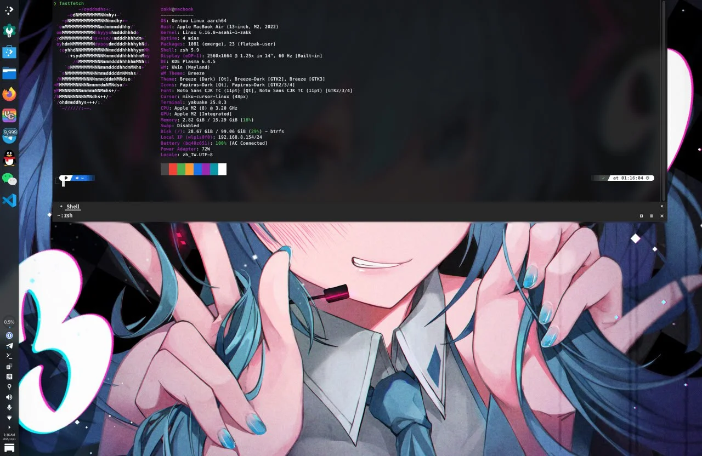

**简介**

本指南将引导你在 Apple Silicon Mac（M1/M2/M3/M4）上安装原生 ARM64 Gentoo Linux。

**重要更新**：Asahi Linux 项目团队（尤其是 [chadmed](https://github.com/chadmed/gentoo-asahi-releng)）的卓越工作使得现在有了[官方 Gentoo Asahi 安装指南](https://wiki.gentoo.org/wiki/Project:Asahi/Guide)，安装流程已大幅简化。

**本指南特色**：
- 基于官方最新流程（2025.10）
- 使用官方 Gentoo Asahi Live USB（无需 Fedora 中转）
- 清楚标记可选与必选步骤
- 简化版适合所有人（包含加密选项）

已验证至 2025 年 11 月 20日。


> **目标平台**：Apple Silicon Mac（M1/M2/M3/M4）ARM64 架构。本指南使用 Asahi Linux 引导程序进行初始设置，然后转换为完整的 Gentoo 环境。

---

## 安装流程总览（简化版）

**必选步骤**：
1. 下载官方 Gentoo Asahi Live USB 镜像
2. 通过 Asahi 安装程序设置 U-Boot 环境
3. 从 Live USB 启动
4. 分割磁盘并挂载文件系统
5. 展开 Stage3 并进入 chroot
6. 安装 Asahi 支持套件（自动化脚本）
7. 重启完成安装

**可选步骤**：
- LUKS 加密（建议但非必须）
- 自定义内核配置（默认 dist-kernel 即可）
- 音频设置（PipeWire，依需求）
- 桌面环境选择

整个流程会在你的 Mac 上建立双启动环境：macOS + Gentoo Linux ARM64。

> **官方简化**：现在可使用 [asahi-gentoosupport 自动化脚本](https://github.com/chadmed/asahi-gentoosupport) 完成大部分配置！

---

## 事前准备与注意事项 {#prerequisites}

### 硬件需求

- Apple Silicon Mac（M1/M2/M3/M4 系列芯片）
- 至少 80 GB 的可用磁盘空间（建议 120 GB+）
- 稳定的网络连接（Wi-Fi 或以太网）
- 备份所有重要数据

### 重要警告

**本指南包含进阶操作**：
- 会调整你的分区表
- 需要与 macOS 共存
- 涉及加密磁盘操作
- Apple Silicon 对 Linux 的支持仍在积极开发中

**已知可运作的功能**：
- CPU、内存、存储设备
- Wi-Fi（通过 Asahi Linux 固件）
- 键盘、触控板、电池管理
- 显示输出（内建屏幕与外接显示器）
- USB-C / Thunderbolt

**已知限制**：
- Touch ID 无法使用
- macOS 虚拟化功能受限
- 部分新硬件功能可能未完全支持
- GPU 加速仍在开发中（OpenGL 部分支持）

---

## 0. 准备 Gentoo Asahi Live USB {#step-0-prepare}

### 0.1 下载官方 Gentoo Asahi Live USB

**官方简化流程**：直接使用 Gentoo 提供的 ARM64 Live USB，无需通过 Fedora！

下载最新版本：
```bash
# 方法 1：作者站点下载
https://chadmed.au/pub/gentoo/

```

> **提示**：官方正在整合 Asahi 支持到标准 Live USB。目前使用 chadmed 维护的版本。

> **镜像版本兼容性信息（更新日期：2025年11月21日）**：
> - **社区构建版本**：由 [Zakkaus](https://github.com/zakkaus) 基于 [gentoo-asahi-releng](https://github.com/chadmed/gentoo-asahi-releng) 构建的镜像
>   - **特色**：systemd + KDE Plasma 桌面环境，预装中文支持和 Fcitx5 输入法，音频和 Wi-Fi 开箱即用
>   - **下载链接**：[Google Drive](https://drive.google.com/drive/folders/1ZYGkc8uXqRFJ4jeaSbm5odeNb2qvh6CS)
>   - **适用场景**：推荐新手使用，已成功在 M2 MacBook 上测试
>   - 若有兴趣自行构建，可参考 [gentoo-asahi-releng](https://github.com/chadmed/gentoo-asahi-releng) 项目
> - **官方版本**：
>   - **推荐使用**：`install-arm64-asahi-20250603.iso`（2025年6月版本，已测试稳定）
>   - **可能无法启动**：`install-arm64-asahi-20251022.iso`（2025年10月版本）在某些设备（如 M2 MacBook）上可能无法正常启动
>   - **建议**：如果 latest 版本无法启动，请尝试使用 20250603 版本或社区构建版本

### 0.2 制作启动 USB

在 macOS 中：

```bash
# 查看 USB 设备名称
diskutil list

# 卸载 USB（假设为 /dev/disk4）
diskutil unmountDisk /dev/disk4

# 写入镜像（注意使用 rdisk 较快）
sudo dd if=install-arm64-asahi-*.iso of=/dev/rdisk4 bs=4m status=progress

# 完成后弹出
diskutil eject /dev/disk4
```

---

## 1. 设置 Asahi U-Boot 环境 {#step-1-asahi}

### 1.1 执行 Asahi 安装程序

在 macOS Terminal 中执行：

```bash
curl https://alx.sh | sh
```

> **安全提示**：建议先前往 <https://alx.sh> 查看脚本内容，确认安全后再执行。

### 1.2 跟随安装程序步骤

安装程序会引导你：

1. **选择动作**：输入 `r` (Resize an existing partition to make space for a new OS)

2. **选择分区空间**：决定分配给 Linux 的空间（建议至少 80 GB）
   - 可使用百分比（如 `50%`）或绝对大小（如 `120GB`）
   
   > **提示**：建议保留 macOS 分区，以便日后更新固件。

3. **选择操作系统**：选择 **UEFI environment only (m1n1 + U-Boot + ESP)**
   ```
   » OS: <选择 UEFI only 选项>
   ```
   
   > **官方建议**：选择 UEFI only 即可，不需要安装完整发行版。

4. **设置名称**：输入 `Gentoo` 作为操作系统名称
   ```
   » OS name: Gentoo
   ```

5. **完成安装**：记下屏幕指示，然后按 Enter 关机。

### 1.3 完成 Recovery 模式设置（关键步骤）

**重要的重启步骤**：

1. **等待 25 秒**确保系统完全关机
2. **按住电源键**直到看到「Loading startup options...」或旋转图标
3. **释放电源键**
4. 等待音量列表出现，选择 **Gentoo**
5. 你会看到 macOS Recovery 画面：
   - 若要求「Select a volume to recover」，选择你的 macOS 音量并点击 Next
   - 输入 macOS 用户密码（FileVault 用户）
6. 依照屏幕指示完成设置

> **故障排除**：若遇到启动循环或要求重新安装 macOS，请按住电源键完全关机，然后从步骤 1 重新开始。可选择 macOS 开机，执行 `curl https://alx.sh | sh` 并选择 `p` 选项重试。

---

## 2. 从 Live USB 启动 {#step-2-boot}

### 2.1 连接 Live USB 并启动

1. **插入 Live USB**（可通过 USB Hub 或 Dock）
2. **启动 Mac**
3. **U-Boot 自动启动**：
   - 若选择了「UEFI environment only」，U-Boot 会自动从 USB 启动 GRUB
   - 等待 2 秒自动启动序列
   - 若有多个系统，可能需要中断并手动选择

> **提示**：若需手动指定 USB 启动，在 U-Boot 提示符下执行：
> ```
> setenv boot_targets "usb"
> setenv bootmeths "efi"
> boot
> ```

### 2.2 设置网络（Live 环境）

Gentoo Live USB 内建网络工具：

**Wi-Fi 连接**：
```bash
net-setup
```

依照互动提示设置网络。完成后检查：

```bash
ping -c 3 www.gentoo.org
```

> **提示**：Apple Silicon 的 Wi-Fi 已包含在内核中，应可正常运作。若不稳定，尝试连接 2.4 GHz 网络。

**（可选）SSH 远程操作**：
```bash
passwd                     # 设置 root 密码
/etc/init.d/sshd start
ip a | grep inet          # 获取 IP 地址
```

---

## 3. 分区与文件系统设置 {#step-3-partition}

### 3.1 识别磁盘与分区

> **重要警告**：**不要修改现有的 APFS 容器、EFI 分区或 Recovery 分区！** 只能在 Asahi 安装程序预留的空间中操作。

查看分区结构：
```bash
lsblk
blkid --label "EFI - GENTO"  # 查看你的 EFI 分区
```

通常会看到：
```
NAME        MAJ:MIN RM   SIZE RO TYPE MOUNTPOINTS
loop0         7:0    0 609.1M  1 loop /run/rootfsbase
sda           8:0    1 119.5G  0 disk /run/initramfs/live
|-sda1        8:1    1   118K  0 part 
|-sda2        8:2    1   2.8M  0 part 
`-sda3        8:3    1 670.4M  0 part 
nvme0n1     259:0    0 465.9G  0 disk 
|-nvme0n1p1 259:1    0   500M  0 part 
|-nvme0n1p2 259:2    0 307.3G  0 part 
|-nvme0n1p3 259:3    0   2.3G  0 part 
|-nvme0n1p4 259:4    0   477M  0 part 
`-nvme0n1p5 259:5    0     5G  0 part 
nvme0n2     259:6    0     3M  0 disk 
nvme0n3     259:7    0   128M  0 disk 
```

EFI 分区识别（**不要动这个分区！**）：
```bash
livecd ~ # blkid --label "EFI - GENTO" 
/dev/nvme0n1p4  # 这是 EFI 分区勿动
```


> **建议**：使用 `cfdisk` 进行分区，它理解 Apple 分区类型并会保护系统分区。

### 3.2 建立根分区

假设空白空间从 `/dev/nvme0n1p5` 开始：

**方法 A：简单分区（无加密）**

```bash
# 使用 cfdisk 建立新分区
cfdisk /dev/nvme0n1
```

你会看到类似以下的分区表：
```
                                            Disk: /dev/nvme0n1
                         Size: 465.92 GiB, 500277792768 bytes, 122138133 sectors
                       Label: gpt, identifier: 6C5A96F2-EFC9-487C-8C3E-01FD5EA77896

    Device                      Start            End       Sectors        Size Type
    /dev/nvme0n1p1                  6         128005        128000        500M Apple Silicon boot
    /dev/nvme0n1p2             128006       80694533      80566528      307.3G Apple APFS
    /dev/nvme0n1p3           80694534       81304837        610304        2.3G Apple APFS
    /dev/nvme0n1p4           81304838       81426949        122112        477M EFI System
>>  Free space               81427200      120827418      39400219      150.3G                            
    /dev/nvme0n1p5          120827419      122138127       1310709          5G Apple Silicon recovery

                        [   New  ]  [  Quit  ]  [  Help  ]  [  Write ]  [  Dump  ]

                                   Create new partition from free space
```

操作步骤：
1. 选择 **Free space** → **New**
2. 使用全部空间（或自定义大小）
3. **Type** → 选择 **Linux filesystem**
4. **Write** → 输入 `yes` 确认
5. **Quit** 离开

**格式化分区**：
```bash
# 格式化为 ext4 或 btrfs
mkfs.ext4 /dev/nvme0n1p6
# 或
mkfs.btrfs /dev/nvme0n1p6

# 挂载
mount /dev/nvme0n1p6 /mnt/gentoo
```

**方法 B：加密分区（可选，建议）**

```bash
# 建立 LUKS2 加密分区
cryptsetup luksFormat --type luks2 --pbkdf argon2id --hash sha512 --key-size 512 /dev/nvme0n1p6

# 输入 YES 确认，设置加密密码

# 打开加密分区
cryptsetup luksOpen /dev/nvme0n1p6 gentoo-root

# 格式化
mkfs.btrfs --label root /dev/mapper/gentoo-root

# 挂载
mount /dev/mapper/gentoo-root /mnt/gentoo
```

> **为什么用这些参数？**
> - `argon2id`：抗 ASIC/GPU 暴力破解
> - `aes-xts`：M1 有 AES 指令集，硬件加速
> - `luks2`：更好的安全工具

### 3.3 挂载 EFI 分区

```bash
mkdir -p /mnt/gentoo/boot
mount /dev/nvme0n1p4 /mnt/gentoo/boot
```

---

## 4. Stage3 与 chroot {#step-4-stage3}

> **从这里开始遵循 [AMD64 Handbook](https://wiki.gentoo.org/wiki/Handbook:AMD64)** 直到内核安装章节。

### 4.1 下载并展开 Stage3

```bash
cd /mnt/gentoo

# 下载最新 ARM64 Desktop systemd Stage3
wget https://distfiles.gentoo.org/releases/arm64/autobuilds/current-stage3-arm64-desktop-systemd/stage3-arm64-desktop-systemd-*.tar.xz

# 展开（保持属性）
tar xpvf stage3-*.tar.xz --xattrs-include='*.*' --numeric-owner
```

### 4.2 设置 Portage

```bash
mkdir --parents /mnt/gentoo/etc/portage/repos.conf
cp /mnt/gentoo/usr/share/portage/config/repos.conf /mnt/gentoo/etc/portage/repos.conf/gentoo.conf
```

### 4.3 同步系统时间（重要）

在进入 chroot 前，确保系统时间正确（避免编译和 SSL 证书问题）：

```bash
# 同步时间
chronyd -q

# 验证时间是否正确
date
```

> **为什么需要同步时间？**
> - 编译软件包时需要正确的时间戳
> - SSL/TLS 证书验证依赖准确的系统时间
> - 如果时间不正确，可能导致 emerge 失败或证书错误

### 4.4 进入 chroot 环境

**挂载必要文件系统**：
```bash
cp --dereference /etc/resolv.conf /mnt/gentoo/etc/
mount --types proc /proc /mnt/gentoo/proc
mount --rbind /sys /mnt/gentoo/sys
mount --make-rslave /mnt/gentoo/sys
mount --rbind /dev /mnt/gentoo/dev
mount --make-rslave /mnt/gentoo/dev
mount --bind /run /mnt/gentoo/run
mount --make-slave /mnt/gentoo/run
```

**进入 chroot**：
```bash
chroot /mnt/gentoo /bin/bash
source /etc/profile
export PS1="(chroot) ${PS1}"
```

### 4.5 基本系统配置

**设置 make.conf**（针对 Apple Silicon 优化）：

编辑 `/etc/portage/make.conf`：
```bash
nano -w /etc/portage/make.conf
```

加入或修改以下内容：
```conf
# vim: set language=bash;
CHOST="aarch64-unknown-linux-gnu"

# Apple Silicon 优化编译参数
COMMON_FLAGS="-march=armv8.5-a+fp16+simd+crypto+i8mm -mtune=native -O2 -pipe"
CFLAGS="${COMMON_FLAGS}"
CXXFLAGS="${COMMON_FLAGS}"
FCFLAGS="${COMMON_FLAGS}"
FFLAGS="${COMMON_FLAGS}"
RUSTFLAGS="-C target-cpu=native"

# 保持构建输出为英文（报告错误时请保留此设置）
LC_MESSAGES=C

# 根据硬件调整（例如 M2 Max 有更多核心）
MAKEOPTS="-j4"

# Gentoo 镜像源（推荐使用 R2 镜像，速度较快）
GENTOO_MIRRORS="https://gentoo.rgst.io/gentoo"

# Emerge 默认选项（最多同时编译 3 个包）
EMERGE_DEFAULT_OPTS="--jobs 3"

# Asahi GPU 驱动
VIDEO_CARDS="asahi"

# 中文本地化支持（可选）
L10N="zh-CN zh-TW zh en"

# 文件末尾保留换行符！重要！
```

**同步 Portage**：
```bash
emerge-webrsync
```

**设置时区**：
```bash
# 设置为台湾时区（或改为你所在的时区）
ln -sf /usr/share/zoneinfo/Asia/Taipei /etc/localtime
```

**设置语系**：
```bash
# 编辑 locale.gen，取消注释需要的语系
nano -w /etc/locale.gen
# 取消注释：en_US.UTF-8 UTF-8
# 取消注释：zh_CN.UTF-8 UTF-8（如需中文）

# 生成语系
locale-gen

# 选择系统默认语系
eselect locale set en_US.utf8

# 重新加载环境
env-update && source /etc/profile && export PS1="(chroot) ${PS1}"
```

**建立用户与设置密码**：
```bash
# 建立用户（替换 <用户名称> 为你的用户名）
useradd -m -G wheel,audio,video,usb,input <用户名称>

# 设置用户密码
passwd <用户名称>

# 设置 root 密码
passwd root
```

---

## 5. 安装 Asahi 支持套件（核心步骤）{#step-5-asahi}

> **官方简化流程**：这一章节取代 Handbook 的「安装内核」章节。

### 5.1 方法 A：自动化安装（推荐）

**步骤 1：安装 git**

```bash
# 首次同步 Portage 树
emerge --sync

# 安装 git（下载脚本需要）
emerge --ask dev-vcs/git
```

**步骤 2：使用 asahi-gentoosupport 脚本**（官方提供）：

```bash
cd /tmp
git clone https://github.com/chadmed/asahi-gentoosupport
cd asahi-gentoosupport
./install.sh
```

此脚本会自动完成：
- 启用 Asahi overlay
- 安装 GRUB bootloader
- 设置 VIDEO_CARDS="asahi"
- 安装 asahi-meta（包含内核、固件、m1n1、U-Boot）
- 执行 `asahi-fwupdate` 和 `update-m1n1`
- 更新系统

> **如果遇到 USE flag 冲突**：
> 脚本执行过程中可能会提示 USE flag 需要变更。解决方法：
> ```bash
> # 当脚本提示 USE flag 冲突时，按 Ctrl+C 中断脚本
> # 然后运行：
> emerge --autounmask-write <出现冲突的软件包>
>
> # 更新配置文件
> etc-update
> # 在 etc-update 中选择合适的选项（通常选择 -3 自动合并）
>
> # 重新运行安装脚本
> cd /tmp/asahi-gentoosupport
> ./install.sh
> ```

**脚本完成后直接跳到步骤 5.3（fstab 配置）！**

---

### 5.2 方法 B：手动安装（进阶用户）

**步骤 1：安装 git 并配置 Asahi overlay**

```bash
# 首次同步 Portage 树
emerge --sync

# 安装 git（用于 git 同步方式）
emerge --ask dev-vcs/git

# 删除旧的 Portage 数据库并切换到 git 同步
rm -rf /var/db/repos/gentoo
sudo tee /etc/portage/repos.conf/gentoo.conf << 'EOF'
[DEFAULT]
main-repo = gentoo

[gentoo]
location = /var/db/repos/gentoo
sync-type = git
sync-uri = https://mirrors.bfsu.edu.cn/git/gentoo-portage.git
auto-sync = yes
sync-depth = 1
EOF

# 配置 Asahi overlay 使用 git 同步
sudo tee /etc/portage/repos.conf/asahi.conf << 'EOF'
[asahi]
location = /var/db/repos/asahi
sync-type = git
sync-uri = https://github.com/chadmed/asahi-overlay.git
auto-sync = yes
EOF

# 同步所有仓库
emerge --sync
```

> **镜像源说明**：
> - **简体中文用户推荐**：可以将上面的 `sync-uri` 改为北外源 `https://mirrors.bfsu.edu.cn/git/gentoo-portage.git` 以获得更快的同步速度
> - 更多镜像源选项参考：[镜像列表](/mirrorlist/)

**步骤 2：配置 package.mask（重要！）**

防止 Gentoo 官方的 dist-kernel 覆盖 Asahi 版本：

```bash
mkdir -p /etc/portage/package.mask
cat > /etc/portage/package.mask/asahi << 'EOF'
# Mask the upstream dist-kernel virtual so it doesn't try to force kernel upgrades
virtual/dist-kernel::gentoo
EOF
```

**步骤 3：配置 package.use**

```bash
mkdir -p /etc/portage/package.use

# Asahi 专用 USE flags
cat > /etc/portage/package.use/asahi << 'EOF'
dev-lang/rust-bin rustfmt rust-src
dev-lang/rust rustfmt rust-src
EOF

# VIDEO_CARDS 设置
echo 'VIDEO_CARDS="asahi"' >> /etc/portage/make.conf

# GRUB 平台设置（必须！）
echo 'GRUB_PLATFORMS="efi-64"' >> /etc/portage/make.conf
```

**步骤 4：配置固件许可证**

```bash
mkdir -p /etc/portage/package.license
echo 'sys-kernel/linux-firmware linux-fw-redistributable no-source-code' > /etc/portage/package.license/firmware
```

**步骤 5：安装 rust-bin（必须先安装！）**

```bash
emerge -q1 dev-lang/rust-bin
```

**步骤 6：安装 Asahi 套件**

```bash
# 一次性安装所有必要套件
emerge -q sys-apps/asahi-meta virtual/dist-kernel:asahi sys-kernel/linux-firmware
```

> 如果 `etc-update` 出现配置文件冲突，选择 `-3` 进行自动合并。

套件说明：
- `rust-bin`：编译 Asahi 内核组件需要（必须先安装）
- `asahi-meta`：包含 m1n1、asahi-fwupdate、U-Boot 等工具
- `virtual/dist-kernel:asahi`：Asahi 特制内核（包含未上游的补丁）
- `linux-firmware`：提供 Wi-Fi 等硬件固件

**步骤 7：更新固件与引导程序**

```bash
asahi-fwupdate
update-m1n1
```

> **重要**：每次更新内核、U-Boot 或 m1n1 时都必须执行 `update-m1n1`！

**步骤 8：安装并配置 GRUB**

```bash
# 安装 GRUB
emerge -q grub:2

# 安装 GRUB 到 ESP（注意 --removable 标志很重要！）
grub-install --boot-directory=/boot/ --efi-directory=/boot/ --removable

# 生成 GRUB 配置
grub-mkconfig -o /boot/grub/grub.cfg
```

> **关键要点**：
> - `--removable` 标志是必须的，确保系统能从 ESP 启动
> - `--boot-directory` 和 `--efi-directory` 都必须指向 `/boot/`
> - 必须在 make.conf 中设置 `GRUB_PLATFORMS="efi-64"`

**步骤 9：更新系统（可选）**

```bash
emerge --ask --update --deep --changed-use @world
```

---

### 5.3 配置 fstab

获取 UUID：
```bash
blkid $(blkid --label root)       # 根分区（或 /dev/mapper/gentoo-root）
blkid $(blkid --label "EFI - GENTO")     # boot 分区
```

编辑 `/etc/fstab`：
```bash
nano -w /etc/fstab
```

```fstab
# 根分区（依你的配置调整）
UUID=<your-root-uuid>  /      ext4   defaults  0 1
# 或加密版本：
# UUID=<your-btrfs-uuid>  /      btrfs  defaults  0 1

UUID=<your-boot-uuid>  /boot  vfat   defaults  0 2
```

### 5.4 配置加密支持（仅加密用户）

> **注意**：如果你在步骤 3.2 中选择了加密分区，才需要执行此步骤。

**步骤 1：启用 systemd cryptsetup 支持**

```bash
mkdir -p /etc/portage/package.use
echo "sys-apps/systemd cryptsetup" >> /etc/portage/package.use/fde

# 重新编译 systemd 以启用 cryptsetup 支持
emerge --ask --oneshot sys-apps/systemd
```

**步骤 2：获取 LUKS 分区的 UUID**

```bash
# 获取 LUKS 加密容器的 UUID（不是里面的文件系统 UUID）
blkid /dev/nvme0n1p5
```

输出示例：
```
/dev/nvme0n1p5: UUID="a1b2c3d4-e5f6-7890-abcd-ef1234567890" TYPE="crypto_LUKS" ...
```

记下这个 **LUKS UUID**（例如：`a1b2c3d4-e5f6-7890-abcd-ef1234567890`）。

**步骤 3：配置 GRUB 内核参数**

```bash
nano -w /etc/default/grub
```

加入或修改以下内容（**替换 UUID 为实际值**）：
```conf
# 完整示例（替换 UUID 为你的实际 UUID）
GRUB_CMDLINE_LINUX="rd.luks.uuid=3f5a6527-7334-4363-9e2d-e0e8c7c04488 rd.luks.allow-discards root=UUID=f3db74a5-dc70-48dd-a9a3-797a0daf5f5d rootfstype=btrfs"
```

> **参数说明**：
> - `rd.luks.uuid=<UUID>`：LUKS 加密分区的 UUID（使用 `blkid /dev/nvme0n1p6` 获取）
> - `rd.luks.allow-discards`：允许 SSD TRIM 命令穿透加密层（提升 SSD 性能）
> - `root=UUID=<UUID>`：解密后的 btrfs 文件系统 UUID（使用 `blkid /dev/mapper/gentoo-root` 获取）
> - `rootfstype=btrfs`：根文件系统类型（如果使用 ext4 改为 `ext4`）

**步骤 4：安装并配置 dracut**

```bash
# 安装 dracut（如果还没安装）
emerge --ask sys-kernel/dracut
```

**步骤 5：配置 dracut for LUKS 解密**

创建 dracut 配置文件：
```bash
nano -w /etc/dracut.conf.d/luks.conf
```

加入以下内容：
```conf
# 不要在这里设置 kernel_cmdline，GRUB 会覆盖它
kernel_cmdline=""
# 添加必要的模块支持 LUKS + btrfs
add_dracutmodules+=" btrfs systemd crypt dm "
# 添加必要的工具
install_items+=" /sbin/cryptsetup /bin/grep "
# 指定文件系统（如果使用其他文件系统请修改）
filesystems+=" btrfs "
```

> **配置说明**：
> - `crypt` 和 `dm` 模块提供 LUKS 解密支持
> - `systemd` 模块用于 systemd 启动环境
> - `btrfs` 模块支持 btrfs 文件系统（如果使用 ext4 改为 `ext4`）

**步骤 6：配置 /etc/crypttab（可选但推荐）**

```bash
nano -w /etc/crypttab
```

加入以下内容（**替换 UUID 为你的 LUKS UUID**）：
```conf
gentoo-root UUID=<LUKS-UUID> none luks,discard
```

> 这样配置后，系统会自动识别并提示解锁加密分区。

**步骤 7：重新生成 initramfs**

```bash
# 获取当前内核版本
dracut --kver $(make -C /usr/src/linux -s kernelrelease) --force
```

> **重要**：每次更新内核后，也需要重新执行此命令生成新的 initramfs！

**步骤 8：更新 GRUB 配置**

```bash
grub-mkconfig -o /boot/grub/grub.cfg

# 验证 initramfs 被正确引用
grep initrd /boot/grub/grub.cfg
```

---

## 6. 完成安装与重启 {#step-6-finalize}

### 6.1 最后设置

**设置主机名称**：
```bash
echo "macbook" > /etc/hostname
```

**启用 NetworkManager**（桌面系统）：
```bash
systemctl enable NetworkManager
```

**设置 root 密码**（如果还没设置）：
```bash
passwd root
```

### 6.2 离开 chroot 并重启

```bash
exit
umount -R /mnt/gentoo
# 若使用加密：
cryptsetup luksClose gentoo-root

reboot
```

### 6.3 首次启动

1. U-Boot 会自动启动
2. GRUB 菜单出现，选择 Gentoo
3. （若加密）输入 LUKS 密码
4. 系统应成功启动到登录提示

> **恭喜！基本系统已安装完成！**

---

## 7. 安装后配置（可选）{#step-7-post}

### 7.1 网络连接

```bash
# Wi-Fi
nmcli device wifi connect <SSID> password <密码>

# 或使用 nmtui（图形界面）
nmtui
```

### 7.2 安装桌面环境（可选）

> **重要提示**：安装桌面环境前，建议切换到对应的系统 profile，这会自动设置许多必要的 USE flags。

#### 步骤 1：查看并选择系统 Profile

```bash
# 列出所有可用的 profile
eselect profile list
```

输出示例：
```
Available profile symlink targets:
  [1]   default/linux/arm64/23.0 (stable)
  [2]   default/linux/arm64/23.0/systemd (stable) *
  [3]   default/linux/arm64/23.0/desktop (stable)
  [4]   default/linux/arm64/23.0/desktop/gnome (stable)
  [5]   default/linux/arm64/23.0/desktop/gnome/systemd (stable)
  [6]   default/linux/arm64/23.0/desktop/plasma (stable)
  [7]   default/linux/arm64/23.0/desktop/plasma/systemd (stable)
```

**选择合适的 profile**：

```bash
# GNOME 桌面
eselect profile set 5    # desktop/gnome/systemd

# KDE Plasma 桌面（推荐）
eselect profile set 7    # desktop/plasma/systemd

# 通用桌面环境（Xfce 等）
eselect profile set 3    # desktop (不含特定桌面)
```

> **Profile 说明**：
> - `desktop/gnome/systemd`：自动启用 GNOME 相关 USE flags（gtk、gnome、wayland 等）
> - `desktop/plasma/systemd`：自动启用 KDE 相关 USE flags（qt5、kde、plasma 等）
> - `desktop`：基础桌面 USE flags（X、dbus、networkmanager 等）

#### 步骤 2：更新系统以应用新 Profile

切换 profile 后，需要重新编译受影响的软件包：

```bash
# 更新所有软件包以应用新的 USE flags
emerge -avuDN @world
```

#### 步骤 3：安装桌面环境

**选项 A：KDE Plasma（推荐）**

```bash
# 安装 KDE Plasma 桌面
emerge --ask kde-plasma/plasma-meta kde-apps/kate kde-apps/dolphin

# 启用显示管理器
systemctl enable sddm

# 安装常用应用（可选）
emerge --ask kde-apps/konsole \
             kde-apps/okular \
             www-client/firefox
```

**选项 B：GNOME**

```bash
# 安装完整 GNOME 桌面
emerge --ask gnome-base/gnome gnome-extra/gnome-tweaks

# 启用显示管理器
systemctl enable gdm

# 安装常用应用（可选）
emerge --ask gnome-extra/gnome-system-monitor \
             gnome-extra/gnome-calculator \
             www-client/firefox
```

**选项 C：Xfce（轻量级）**

```bash
# 先切换回通用桌面 profile
eselect profile set 3    # desktop

# 更新系统
emerge -avuDN @world

# 安装 Xfce
emerge --ask xfce-base/xfce4-meta xfce-extra/xfce4-pulseaudio-plugin

# 安装并启用显示管理器
emerge --ask x11-misc/lightdm
systemctl enable lightdm
```

#### 步骤 4：优化桌面性能（可选）

**启用视频加速（Asahi GPU）**：

```bash
# 检查 VIDEO_CARDS 设置
grep VIDEO_CARDS /etc/portage/make.conf
# 应该包含：VIDEO_CARDS="asahi"

# 安装 Mesa 与 Asahi 驱动（通常已安装）
emerge --ask media-libs/mesa
```

**启用字体渲染**：

```bash
# 安装基础字体
emerge --ask media-fonts/liberation-fonts \
             media-fonts/noto \
             media-fonts/noto-cjk \
             media-fonts/dejavu

# 启用字体微调
eselect fontconfig enable 10-sub-pixel-rgb.conf
eselect fontconfig enable 11-lcdfilter-default.conf
```

**中文输入法配置**：

```bash
# 安装 Fcitx5 中文输入法
emerge --ask app-i18n/fcitx-chinese-addons
```

> **注意**：`app-i18n/fcitx-rime` 在当前版本实测无法正常使用，建议使用 `app-i18n/fcitx-chinese-addons` 作为替代方案。

> **提示**：
> - 首次安装桌面环境预计需要 **2-4 小时**（取决于 CPU 性能）
> - 建议使用 `--jobs 3` 或更少，避免内存不足
> - 可以在 `/etc/portage/make.conf` 设置 `EMERGE_DEFAULT_OPTS="--jobs 3 --load-average 8"`

### 7.3 音频配置（可选）

Asahi 音频通过 PipeWire 提供。安装并启用相关服务：

```bash
# 安装 Asahi 音频支持
emerge --ask media-libs/asahi-audio

# 启用 PipeWire 服务
systemctl --user enable --now pipewire-pulse.service
systemctl --user enable --now wireplumber.service
```
---

## 8. 系统维护 {#step-8-maintenance}

### 8.1 定期更新流程

```bash
# 更新 Portage 树（包含 Asahi overlay）
emerge --sync
# 或手动同步 Asahi overlay：
emaint -r asahi sync

# 更新所有套件
emerge -avuDN @world

# 清理不需要的套件
emerge --depclean

# 更新配置文件
dispatch-conf
```

### 8.2 更新内核后必做

> **极度重要**：每次内核更新后必须执行！

```bash
# 更新 m1n1 Stage 2（包含 devicetree）
update-m1n1

# 重新生成 GRUB 配置
grub-mkconfig -o /boot/grub/grub.cfg
```

**为什么？** m1n1 Stage 2 包含 devicetree blobs，内核需要它来识别硬件。不更新可能导致无法启动或功能缺失。

> **自动化**：`sys-apps/asahi-scripts` 提供 installkernel hook 自动执行这些步骤。

### 8.3 更新固件

macOS 系统更新时会包含固件更新。**建议保留 macOS 分区**以便获取最新固件。

---

## 9. 常见问题与排错 {#faq}

### 问题：无法从 USB 启动

**可能原因**：U-Boot 的 USB 驱动仍有限制。

**解决方法**：
- 尝试不同的 USB 闪存盘
- 使用 USB 2.0 设备（兼容性较好）
- 通过 USB Hub 连接

### 问题：启动卡住或黑屏

**原因**：m1n1/U-Boot/内核不匹配。

**解决方法**：
1. 从 macOS 重新执行 Asahi 安装程序
2. 选择 `p` 选项重试 Recovery 流程
3. 确保在 chroot 中执行了 `update-m1n1`

### 问题：加密分区无法解锁

**原因**：dracut 配置错误或 UUID 不对。

**解决方法**：
1. 检查 `/etc/default/grub` 中的 `GRUB_CMDLINE_LINUX`
2. 确认使用正确的 LUKS UUID：`blkid /dev/nvme0n1p5`
3. 重新生成 GRUB 配置：`grub-mkconfig -o /boot/grub/grub.cfg`

### 问题：Wi-Fi 不稳定

**原因**：可能是 WPA3 或 6 GHz 频段问题。

**解决方法**：
- 连接 WPA2 网络
- 使用 2.4 GHz 或 5 GHz 频段（避免 6 GHz）

### 问题：触控板无法使用

**原因**：固件未加载或驱动问题。

**解决方法**：
```bash
# 检查固件
dmesg | grep -i firmware

# 确保安装了 asahi-meta
emerge --ask sys-apps/asahi-meta
```

---

## 10. 进阶技巧（可选）{#advanced}

### 10.1 刘海（Notch）配置

默认刘海区域会显示为黑色。要启用：

```bash
# 在 GRUB 内核参数中加入
apple_dcp.show_notch=1
```

**KDE Plasma 优化**：
- 在顶部新增全宽面板，高度对齐刘海底部
- 左侧：Application Dashboard、Global menu、Spacer
- 右侧：System Tray、Bluetooth、Power、时钟

### 10.2 自定义内核（进阶）

使用 Distribution kernel 即可，但若要自定义：

```bash
emerge --ask sys-kernel/asahi-sources
cd /usr/src/linux
make menuconfig
make -j$(nproc)
make modules_install
make install
update-m1n1  # 必须！
grub-mkconfig -o /boot/grub/grub.cfg
```

> **记得保留可用内核作为备援**！

### 10.3 多内核切换

支持多个内核共存：

```bash
eselect kernel list
eselect kernel set <number>
update-m1n1  # 切换后必须执行！
```

---

## 11. 参考资料 {#reference}

### 官方文档

- **[Gentoo Wiki: Project:Asahi/Guide](https://wiki.gentoo.org/wiki/Project:Asahi/Guide)** ⭐ 官方最新指南
- [Asahi Linux Official Site](https://asahilinux.org/)
- [Asahi Linux Feature Support](https://asahilinux.org/docs/platform/feature-support/overview/)
- [Gentoo AMD64 Handbook](https://wiki.gentoo.org/wiki/Handbook:AMD64)（流程相同）

### 工具与脚本

- [asahi-gentoosupport](https://github.com/chadmed/asahi-gentoosupport) - 自动化安装脚本
- [Gentoo Asahi Releng](https://github.com/chadmed/gentoo-asahi-releng) - Live USB 构建工具

### 社区支持

**Gentoo 中文社区**：
- Telegram 群组：[@gentoo_zh](https://t.me/gentoo_zh)
- Telegram 频道：[@gentoocn](https://t.me/gentoocn)
- [GitHub](https://github.com/gentoo-zh)

**官方社区**：
- [Gentoo Forums](https://forums.gentoo.org/)
- IRC: `#gentoo` 和 `#asahi` @ [Libera.Chat](https://libera.chat/)
- [User:Jared/Gentoo On An M1 Mac](https://wiki.gentoo.org/wiki/User:Jared/Gentoo_On_An_M1_Mac)
- [Asahi Linux Discord](https://discord.gg/asahi-linux)

### 延伸阅读

- [Asahi Linux Open OS Interoperability](https://asahilinux.org/docs/platform/open-os-interop/) - 理解 Apple Silicon 启动流程
- [Linux Kernel Devicetree](https://docs.kernel.org/devicetree/usage-model.html) - 为什么需要 update-m1n1

---

## 结语

**祝你在 Apple Silicon 上享受 Gentoo！**

这份指南基于官方 [Project:Asahi/Guide](https://wiki.gentoo.org/wiki/Project:Asahi/Guide) 并简化流程，标记了可选步骤，让更多人能轻松尝试。

**记住三个关键点**：
1. 使用官方 Gentoo Asahi Live USB（无需 Fedora 中转）
2. asahi-gentoosupport 脚本可自动化大部分流程
3. 每次内核更新后必须执行 `update-m1n1`

有任何问题欢迎到社区提问！
