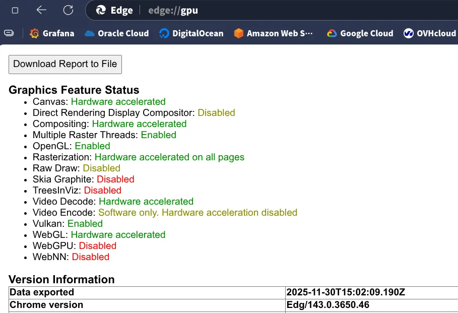

<div style="background: linear-gradient(135deg, rgba(139, 92, 246, 0.1), rgba(124, 58, 237, 0.05)); padding: 2rem; border-radius: 1rem; margin: 1.5rem 0; box-shadow: 0 4px 6px rgba(0, 0, 0, 0.05);">

### 文章特別說明

本文是 **Gentoo Linux 安裝指南** 系列的第二部分：**桌面配置**。

**系列導航**：
1. [基礎安裝](/posts/2025-11-25-gentoo-install-base/)：從零開始安裝 Gentoo 基礎系統
2. **桌面配置（本文）**：顯示卡驅動、桌面環境、輸入法等
3. [進階最佳化](/posts/2025-11-25-gentoo-install-advanced/)：make.conf 最佳化、LTO、系統維護

**上一步**：[基礎安裝](/posts/2025-11-25-gentoo-install-base/)

</div>


## 12. 重啟後的配置 {#step-12-post-reboot}

<div style="background: linear-gradient(135deg, rgba(34, 197, 94, 0.1), rgba(22, 163, 74, 0.05)); padding: 1.5rem; border-radius: 0.75rem; border-left: 4px solid rgb(34, 197, 94); margin: 1.5rem 0;">

恭喜你！你已經完成了 Gentoo 的基礎安裝併成功進入了新系統（TTY 介面）。

接下來的章節是**按需配置**。你可以根據自己的需求（伺服器、桌面辦公、遊戲等）選擇性地進行配置和安裝。

</div>

<div style="background: linear-gradient(135deg, rgba(59, 130, 246, 0.1), rgba(37, 99, 235, 0.05)); padding: 1.5rem; border-radius: 0.75rem; margin: 1.5rem 0;">

**重要提示：檢查 Profile 與更新系統**

在開始配置之前，請再次確認 Profile 設定正確，並確保系統處於最新狀態：
```bash
eselect profile list          # 列出所有可用 Profile
eselect profile set <編號>    # 設定選定的 Profile (例如 desktop/plasma/systemd)
emerge -avuDN @world          # 更新系統
```

</div>

現在我們來配置圖形介面和多媒體功能。

### 12.0 網路檢查 [必選]
登入後，請確保網路連線正常。
- **有線網路**：通常會自動連線。
- **無線網路**：使用 `nmtui` (NetworkManager) 或 `iwctl` (iwd) 連線 Wi-Fi。

### 12.1 全域性配置 (make.conf) [必選]

<div style="background: rgba(59, 130, 246, 0.08); padding: 0.75rem 1rem; border-radius: 0.5rem; border-left: 3px solid rgb(59, 130, 246); margin: 1rem 0;">

**可參考**：[make.conf](https://wiki.gentoo.org/wiki//etc/portage/make.conf)

</div>

`/etc/portage/make.conf` 是 Gentoo 的全域性配置檔案。在此階段，我們只需配置顯示卡、輸入裝置和本機化選項。詳細的編譯最佳化配置將在 **Section 13.0** 中介紹。

```bash
vim /etc/portage/make.conf
```

新增或修改以下配置：
```bash
# 顯示卡驅動 (根據硬體選擇)
VIDEO_CARDS="nvidia"        # NVIDIA
# VIDEO_CARDS="amdgpu radeonsi" # AMD
# VIDEO_CARDS="intel i965 iris" # Intel

# 輸入裝置
INPUT_DEVICES="libinput"

# 本機化設定
L10N="en zh zh-CN zh-TW"
LINGUAS="en zh_CN zh_TW"

# 桌面環境支援
USE="${USE} wayland X pipewire pulseaudio alsa"
```

### 12.2 應用配置與更新系統 [必選]

應用新的 USE flags：
```bash
emerge --ask --newuse --deep @world
```


### 12.3 顯示卡驅動 [必選]

<div style="background: rgba(59, 130, 246, 0.08); padding: 0.75rem 1rem; border-radius: 0.5rem; border-left: 3px solid rgb(59, 130, 246); margin: 1rem 0;">

**可參考**：[NVIDIA/nvidia-drivers](https://wiki.gentoo.org/wiki/NVIDIA/nvidia-drivers/zh-tw)

</div>

- **NVIDIA 專有驅動**：`emerge --ask x11-drivers/nvidia-drivers`
- **AMD**：設定 `VIDEO_CARDS="amdgpu radeonsi"`
- **Intel**：設定 `VIDEO_CARDS="intel i965 iris"`

**配置 VAAPI 影片加速**

<div style="background: rgba(59, 130, 246, 0.08); padding: 0.75rem 1rem; border-radius: 0.5rem; border-left: 3px solid rgb(59, 130, 246); margin: 1rem 0;">

**可參考**：[VAAPI](https://wiki.gentoo.org/wiki/VAAPI) · [nvidia-vaapi-driver](https://packages.gentoo.org/packages/media-libs/nvidia-vaapi-driver)

</div>

1. **全域性啟用 VAAPI**：
   在 `/etc/portage/make.conf` 的 `USE` 中新增 `vaapi`。
   ```bash
   # 重新編譯受影響的套件
   emerge --ask --changed-use --deep @world
   ```

2. **安裝驅動與工具**：
   ```bash
   emerge --ask media-video/libva-utils # 安裝 vainfo 用於驗證
   ```

   **NVIDIA 使用者特別步驟**：
   ```bash
   emerge --ask media-libs/nvidia-vaapi-driver
   ```
<div style="background: linear-gradient(135deg, rgba(245, 158, 11, 0.1), rgba(217, 119, 6, 0.05)); padding: 1.5rem; border-radius: 0.75rem; border-left: 4px solid rgb(245, 158, 11); margin: 1.5rem 0;">

**注意**

`nvidia-vaapi-driver` 在 Wayland 下可能存在不穩定性（如 CUDA/OpenGL 互操作問題）。
詳情參考：[NVIDIA Forums](https://forums.developer.nvidia.com/t/is-cuda-opengl-interop-supported-on-wayland/267052)、[Reddit](https://www.reddit.com/r/archlinux/comments/1oeiss0/wayland_nvidia_on_arch/)、[GitHub Issue](https://github.com/elFarto/nvidia-vaapi-driver/issues/387)。

**NVIDIA 使用者還需要在核心引數中啟用 DRM KMS**：
編輯 `/etc/default/grub`，在 `GRUB_CMDLINE_LINUX_DEFAULT` 中新增 `nvidia_drm.modeset=1`。

```bash
grub-mkconfig -o /boot/grub/grub.cfg
```

</div>

   **Intel/AMD 使用者**：
   通常安裝好顯示卡驅動後即可直接支援。

3. **驗證**：
   執行 `vainfo` 檢視輸出，若無錯誤且顯示支援的 Profile 即為成功。

<div style="background: linear-gradient(135deg, rgba(59, 130, 246, 0.1), rgba(37, 99, 235, 0.05)); padding: 1.5rem; border-radius: 0.75rem; margin: 1.5rem 0;">

**關於 Firefox 與硬體加速**

- 系統中的 `ffmpeg` 主要提供 H.264, AAC, HEVC, MP3 等格式的**軟體解碼**支援。
- Firefox (特別是 `firefox-bin`) 自帶了 FFmpeg 函式庫，**不會**自動利用系統 FFmpeg 提供的 NVDEC/NVENC 進行硬體解碼。
- 請訪問 `about:support` 頁面檢視 Firefox 的實際硬體加速狀態。

</div>

<details>
<summary><b>NVIDIA Chromium 硬體加速配置 (推薦方法)（無需 VAAPI，點選展開）</b></summary>

<div style="background: linear-gradient(135deg, rgba(59, 130, 246, 0.1), rgba(37, 99, 235, 0.05)); padding: 1.5rem; border-radius: 0.75rem; margin: 1.5rem 0;">

**提示**

以下配置適用於 Chromium、Chrome、Edge、Electron 應用（如 VSCode）。

</div>

**方法一：使用 Flags 配置檔案（推薦）**

這種方法不需要修改 `.desktop` 檔案,瀏覽器能正確識別為預設瀏覽器。

**1. 環境變數**
建立 `~/.config/environment.d/chromium-nvidia.conf`：
```bash
# NVIDIA 環境變數
__GLX_VENDOR_LIBRARY_NAME=nvidia
__VK_LAYER_NV_optimus=NVIDIA_only
GBM_BACKEND=nvidia-drm
```

**2. Chromium/Chrome Flags 配置**
建立對應的 flags 檔案：

- Chrome Stable: `~/.config/chrome-flags.conf`
- Chrome Unstable: `~/.config/chrome-dev-flags.conf`  
- Chromium: `~/.config/chromium-flags.conf`
- Edge Beta: `~/.config/microsoft-edge-beta-flags.conf`
- Edge Dev: `~/.config/microsoft-edge-dev-flags.conf`

內容如下：
```bash
# Vulkan 影片加速配置
# NVIDIA + Wayland 硬體加速最佳化

--enable-features=VulkanVideoDecoder,Vulkan,VulkanFromANGLE,DefaultANGLEVulkan
--ozone-platform=x11
--use-vulkan=native
--enable-zero-copy
--enable-gpu-rasterization
--ignore-gpu-blocklist
--enable-native-gpu-memory-buffers
```

**3. 應用配置**
重新登入。

> **驗證**：訪問 `chrome://gpu/` 或 `edge://gpu/`，檢視 **Vulkan** 是否顯示為 `Enabled`。



</details>

### 12.4 音訊與藍牙 [可選]

<div style="background: rgba(59, 130, 246, 0.08); padding: 0.75rem 1rem; border-radius: 0.5rem; border-left: 3px solid rgb(59, 130, 246); margin: 1rem 0;">

**可參考**：[PipeWire](https://wiki.gentoo.org/wiki/PipeWire/zh-tw) · [Bluetooth](https://wiki.gentoo.org/wiki/Bluetooth/zh-tw)

</div>

```bash
# 安裝 PipeWire 音訊系統與 WirePlumber 會話管理器
emerge --ask media-video/pipewire media-video/wireplumber


# 安裝藍牙協議棧、工具與管理器 (Blueman 為 GUI 管理器)
emerge --ask net-wireless/bluez net-wireless/bluez-tools net-wireless/blueman
```

**啟動服務 (OpenRC)**
```bash
rc-update add bluetooth default 
/etc/init.d/bluetooth start
```

**啟動服務 (Systemd)**
```bash
# 設定藍牙服務 (系統級)：
sudo systemctl enable --now bluetooth
# 啟用 PipeWire 核心與 PulseAudio 相容層
systemctl --user enable --now pipewire pipewire-pulse
# 啟用 WirePlumber 會話管理器
systemctl --user enable --now wireplumber
```

### 12.5 桌面環境與顯示管理器 [可選]

#### KDE Plasma（Wayland）

<div style="background: rgba(59, 130, 246, 0.08); padding: 0.75rem 1rem; border-radius: 0.5rem; border-left: 3px solid rgb(59, 130, 246); margin: 1rem 0;">

**可參考**：[KDE](https://wiki.gentoo.org/wiki/KDE/zh-tw)

</div>

```bash
echo "kde-plasma/plasma-meta wayland" >> /etc/portage/package.use/plasma
emerge --ask kde-plasma/plasma-meta # 安裝 Plasma 桌面
emerge --ask kde-apps/kde-apps-meta # (可選) 安裝全套 KDE 應用
emerge --ask x11-misc/sddm # 安裝 SDDM 顯示管理器

# OpenRC 配置 (SDDM 沒有獨立的 init 指令碼)
# 參考：https://wiki.gentoo.org/wiki/Display_manager#OpenRC
emerge --ask gui-libs/display-manager-init # 安裝通用顯示管理器 init 指令碼

# 編輯 /etc/conf.d/display-manager
# 設定 DISPLAYMANAGER="sddm" 和 CHECKVT=7
sed -i 's/^DISPLAYMANAGER=.*/DISPLAYMANAGER="sddm"/' /etc/conf.d/display-manager
sed -i 's/^CHECKVT=.*/CHECKVT=7/' /etc/conf.d/display-manager

rc-update add display-manager default
rc-service display-manager start  # 立即啟動 (可選)

# Systemd 配置
systemctl enable sddm
systemctl start sddm  # 立即啟動 (可選)
```

#### GNOME

<div style="background: rgba(59, 130, 246, 0.08); padding: 0.75rem 1rem; border-radius: 0.5rem; border-left: 3px solid rgb(59, 130, 246); margin: 1rem 0;">

**可參考**：[GNOME](https://wiki.gentoo.org/wiki/GNOME/zh-tw)

</div>

```bash
emerge --ask gnome-base/gnome # 安裝 GNOME 核心元件
emerge --ask gnome-base/gdm # 安裝 GDM 顯示管理器
rc-update add gdm default # OpenRC
systemctl enable gdm # 啟用 GDM 顯示管理器 (systemd)
```

#### Hyprland (Wayland 動態平鋪視窗管理器)

<div style="background: rgba(59, 130, 246, 0.08); padding: 0.75rem 1rem; border-radius: 0.5rem; border-left: 3px solid rgb(59, 130, 246); margin: 1rem 0;">

**可參考**：[Hyprland](https://wiki.gentoo.org/wiki/Hyprland)

</div>

```bash
emerge --ask gui-wm/hyprland
```
<div style="background: linear-gradient(135deg, rgba(59, 130, 246, 0.1), rgba(37, 99, 235, 0.05)); padding: 1.5rem; border-radius: 0.75rem; margin: 1.5rem 0;">

**提示**

Hyprland 需要較新的顯示卡驅動支援，建議閱讀 Wiki 進行詳細配置。

</div>

#### 其他選項

如果你需要輕量級桌面，可以考慮 Xfce 或 LXQt：

- **Xfce**: `emerge --ask xfce-base/xfce4-meta` ([Wiki](https://wiki.gentoo.org/wiki/Xfce/zh-tw))
- **LXQt**: `emerge --ask lxqt-base/lxqt-meta` ([Wiki](https://wiki.gentoo.org/wiki/LXQt))
- **Budgie**: `emerge --ask gnome-extra/budgie-desktop` ([Wiki](https://wiki.gentoo.org/wiki/Budgie))

<div style="background: linear-gradient(135deg, rgba(59, 130, 246, 0.1), rgba(37, 99, 235, 0.05)); padding: 1.5rem; border-radius: 0.75rem; margin: 1.5rem 0;">

**更多選擇**

如需檢視其他桌面環境，請參考 [Desktop environment](https://wiki.gentoo.org/wiki/Desktop_environment/zh-tw)。

</div>

### 12.6 本機化與字型 [可選]

<div style="background: rgba(59, 130, 246, 0.08); padding: 0.75rem 1rem; border-radius: 0.5rem; border-left: 3px solid rgb(59, 130, 246); margin: 1rem 0;">

**可參考**：[Localization/Guide](https://wiki.gentoo.org/wiki/Localization/Guide) · [Fonts](https://wiki.gentoo.org/wiki/Fonts)

</div>

為了正常顯示中文，我們需要安裝中文字型。

```bash
# 安裝 Noto CJK (思源) 字型
emerge --ask media-fonts/noto-cjk

# 安裝 Emoji 字型
emerge --ask media-fonts/noto-emoji

# (可選) 文泉驛微米黑
emerge --ask media-fonts/wqy-microhei
```

重新整理字型快取：
```bash
fc-cache -fv
```

### 12.7 輸入法配置 (Fcitx5 & Rime) [可選]

<div style="background: rgba(59, 130, 246, 0.08); padding: 0.75rem 1rem; border-radius: 0.5rem; border-left: 3px solid rgb(59, 130, 246); margin: 1rem 0;">

**可參考**：[Fcitx5](https://wiki.gentoo.org/wiki/Fcitx5)

</div>

Rime 是一款強大的輸入法引擎，支援朙月拼音 (繁體/繁體)、注音、地球拼音等多種輸入方案。

為了在 Wayland 下獲得最佳體驗，我們需要配置環境變數。

**方案 A：Fcitx5 + Rime (KDE/通用推薦)**

適合 KDE Plasma、Hyprland 等環境。

1. **安裝**
   ```bash
   emerge --ask app-i18n/fcitx app-i18n/fcitx-rime app-i18n/fcitx-configtool
   ```

2. **配置環境變數 (Wayland)**

<div style="background: rgba(59, 130, 246, 0.08); padding: 0.75rem 1rem; border-radius: 0.5rem; border-left: 3px solid rgb(59, 130, 246); margin: 1rem 0;">

**可參考**：[Using Fcitx 5 on Wayland](https://fcitx-im.org/wiki/Using_Fcitx_5_on_Wayland/zh-tw)

</div>

   編輯 `/etc/environment`：
   ```bash
   vim /etc/environment
   ```
   寫入：
   ```conf
   # 強制 XWayland 程式使用 Fcitx5
   XMODIFIERS=@im=fcitx
   
   # (可選) 針對非 KDE 環境或特定程式
   GTK_IM_MODULE=fcitx
   QT_IM_MODULE=fcitx
   ```

<div style="background: linear-gradient(135deg, rgba(59, 130, 246, 0.1), rgba(37, 99, 235, 0.05)); padding: 1.5rem; border-radius: 0.75rem; margin: 1.5rem 0;">

**KDE 使用者提示**

在 KDE Plasma 5.27+ 中，建議直接在“系統設定” -> “鍵盤” -> “虛擬鍵盤”中選擇 Fcitx 5，而不需要手動設定上述環境變數（除了 `XMODIFIERS`）。

</div>

3. **啟動**
   - KDE/GNOME 通常會自動啟動。
   - Hyprland/Sway 需要在配置檔案中新增 `exec-once = fcitx5 -d`。

**方案 B：IBus + Rime (GNOME 推薦)**

<div style="background: rgba(59, 130, 246, 0.08); padding: 0.75rem 1rem; border-radius: 0.5rem; border-left: 3px solid rgb(59, 130, 246); margin: 1rem 0;">

**可參考**：[IBus](https://wiki.gentoo.org/wiki/IBus)

</div>

GNOME 對 IBus 整合最好，建議優先使用。

1. **安裝**
   ```bash
   emerge --ask app-i18n/ibus-rime
   ```

2. **啟用**
   進入 GNOME 設定 -> 鍵盤 -> 新增輸入源 -> 選擇 "Chinese (Rime)"。

<div style="background: linear-gradient(135deg, rgba(59, 130, 246, 0.1), rgba(37, 99, 235, 0.05)); padding: 1.5rem; border-radius: 0.75rem; margin: 1.5rem 0;">

**Rime 配置提示**

*   **切換方案**：按 `F4` 鍵。
*   **支援方案**：朙月拼音 (繁體/繁體)、注音、地球拼音等。
*   **使用者配置目錄**：`~/.local/share/fcitx5/rime` (Fcitx5) 或 `~/.config/ibus/rime` (IBus)。

</div>

### 12.8 安全啟動 (Secure Boot) [可選]

<div style="background: rgba(59, 130, 246, 0.08); padding: 0.75rem 1rem; border-radius: 0.5rem; border-left: 3px solid rgb(59, 130, 246); margin: 1rem 0;">

**可參考**：[Secure Boot](https://wiki.gentoo.org/wiki/Secure_Boot)

</div>

如果你需要開啟 Secure Boot，Gentoo 推薦使用 `sbctl` 來簡化配置。

1. **安裝 sbctl**：
    ```bash
    emerge --ask app-crypt/sbctl
    ```
2. **進入 BIOS 設定**：重啟電腦進入 BIOS，將 Secure Boot 模式設為 "Setup Mode" (清除原有金鑰) 並開啟 Secure Boot。
3. **建立並註冊金鑰**：
    進入系統後執行：
    ```bash
    sbctl create-keys
    sbctl enroll-keys -m # -m 套件含 Microsoft 金鑰 (推薦，否則可能無法引導 Windows 或載入某些韌體)
    ```
4. **簽名核心與引導程式**：
    ```bash
    # 自動搜尋並簽名所有已知檔案 (套件括核心、systemd-boot 等)
    sbctl sign-all
    
    # 或者手動簽名 (例如 GRUB)
    # sbctl sign -s /efi/EFI/Gentoo/grubx64.efi
    ```
5. **驗證**：
    ```bash
    sbctl verify
    ```

---

### 12.9 Portage Git Sync & Overlay [可選]

<div style="background: linear-gradient(135deg, rgba(59, 130, 246, 0.1), rgba(37, 99, 235, 0.05)); padding: 1.5rem; border-radius: 0.75rem; margin: 1.5rem 0;">

**為什麼需要這一步？**

預設的 rsync 同步較慢。使用 Git 同步不僅速度更快，而且方便管理。

</div>

**1. 安裝 Git**
```bash
emerge --ask dev-vcs/git
```

**2. 配置 Git 同步**
```bash
mkdir -p /etc/portage/repos.conf
cp /usr/share/portage/config/repos.conf /etc/portage/repos.conf/gentoo.conf
```

編輯 `/etc/portage/repos.conf/gentoo.conf`：
```ini
[DEFAULT]
main-repo = gentoo

[gentoo]
location = /var/db/repos/gentoo
sync-type = git
sync-uri = https://github.com/gentoo-mirror/gentoo.git
auto-sync = yes
```

可用的 Git 映象源：
- **GitHub（國外）**：`https://github.com/gentoo-mirror/gentoo.git`
- **北京外國語大學**：`https://mirrors.bfsu.edu.cn/git/gentoo-portage.git`
- **清華大學**：`https://mirrors.tuna.tsinghua.edu.cn/git/gentoo-portage.git`

**3. 新增 Gentoo-zh Overlay**
   在 `/etc/portage/repos.conf/` 目錄下建立 `gentoo-zh.conf` 檔案，內容如下：
   ```ini
   [gentoo-zh]
   location = /var/db/repos/gentoo-zh
   sync-type = git
   sync-uri = https://github.com/microcai/gentoo-zh.git
   auto-sync = yes
   ```

   **可用的 gentoo-zh Git 映象源（可選）：**
   - **原始源（GitHub）**：`https://github.com/microcai/gentoo-zh.git`
   - **重慶大學**：`https://mirrors.cqu.edu.cn/git/gentoo-zh.git`
   - **南京大學**：`https://mirror.nju.edu.cn/git/gentoo-zh.git`

   **gentoo-zh distfiles 映象（可選）：**
   為加速 gentoo-zh overlay 中軟體套件的下載，可使用以下 distfiles 映象：
   - **原始源**：`https://distfiles.gentoocn.org/`
   - **重慶大學**：`https://mirror.cqu.edu.cn/gentoo-zh`
   - **南京大學**：`https://mirror.nju.edu.cn/gentoo-zh`
   
   使用幫助：https://t.me/gentoocn/56

<div style="background: linear-gradient(135deg, rgba(239, 68, 68, 0.1), rgba(220, 38, 38, 0.05)); padding: 1.5rem; border-radius: 0.75rem; border-left: 4px solid rgb(239, 68, 68); margin: 1.5rem 0;">

**重要提示（更新時間：2025-10-07）**

根據 Gentoo 官方公告，Gentoo 已停止為第三方倉庫提供快取映象支援。從 2025-10-30 起，所有第三方倉庫（套件括 gentoo-zh）的映象配置將從官方倉庫列表中移除。

**這意味著什麼？**
*   `eselect repository` 和 `layman` 等工具仍可正常使用。
*   官方將不再提供快取映象，改為直接從上游源（GitHub）同步。
*   官方倉庫（`::gentoo`、`::guru`、`::kde`、`::science`）不受影響，仍可使用映象。

**如果您之前已新增 gentoo-zh overlay，請更新同步 URI**：

```bash
# 檢視已安裝的倉庫
eselect repository list -i

# 移除舊配置
eselect repository remove gentoo-zh

# 重新啟用（將自動使用正確的上游源）
eselect repository enable gentoo-zh
```

</div>

**4. 執行同步**
```bash
emerge --sync
```

**5. 軟體安裝演示**

例如安裝 `flclash-bin`：

```bash
emerge -pv flclash-bin
```

輸出範例：
```text
These are the packages that would be merged, in order:

Calculating dependencies  
    ... done!
Dependency resolution took 0.45 s (backtrack: 0/20).

[ebuild  N     ] dev-libs/keybinder-0.3.2-r300:3::gentoo  USE="introspection" 371 KiB
[ebuild  N     ] x11-apps/xmessage-1.0.7::gentoo  126 KiB
[ebuild  N     ] net-proxy/flclash-bin-0.8.90::gentoo-zh  39,565 KiB

Total: 3 packages (3 new), Size of downloads: 40,061 KiB
```

確認無誤後，執行安裝：
```bash
emerge --ask flclash-bin
```

---

### 12.10 Flatpak 支援與軟體中心 [可選]

<div style="background: rgba(59, 130, 246, 0.08); padding: 0.75rem 1rem; border-radius: 0.5rem; border-left: 3px solid rgb(59, 130, 246); margin: 1rem 0;">

**可參考**：[Flatpak](https://wiki.gentoo.org/wiki/Flatpak)

</div>

如果你需要使用 Flatpak 或希望在軟體中心管理 Flatpak 應用：

1. **安裝 Flatpak**
   ```bash
   emerge --ask sys-apps/flatpak
   ```

2. **啟用軟體中心支援**
   為了讓 GNOME Software 或 KDE Discover 支援 Flatpak，需要啟用相應的 USE flag。

   **GNOME 使用者**：
   在 `/etc/portage/package.use/gnome` (或新建檔案) 中新增：
   ```conf
   gnome-extra/gnome-software flatpak
   ```

   **KDE 使用者**：
   在 `/etc/portage/package.use/kde` (或新建檔案) 中新增：
   ```conf
   kde-plasma/discover flatpak
   ```

3. **更新軟體中心**
   ```bash
   # GNOME
   emerge --ask --newuse gnome-extra/gnome-software

   # KDE
   emerge --ask --newuse kde-plasma/discover
   ```

<div style="background: linear-gradient(135deg, rgba(59, 130, 246, 0.1), rgba(37, 99, 235, 0.05)); padding: 1.5rem; border-radius: 0.75rem; margin: 1.5rem 0;">

**使用提示**

Flatpak 非常適合安裝專有軟體 (如 QQ, WeChat)。它的沙盒隔離機制可以保證主系統的安全與整潔。

```bash
# 搜尋應用
flatpak search qq
flatpak search wechat

# 安裝 QQ 和 WeChat
flatpak install com.qq.QQ
flatpak install com.tencent.WeChat
```

</div>

---

### 12.11 系統維護 (SSD TRIM & 電源管理) [可選]

**1. SSD TRIM (延長 SSD 壽命)**

<div style="background: rgba(59, 130, 246, 0.08); padding: 0.75rem 1rem; border-radius: 0.5rem; border-left: 3px solid rgb(59, 130, 246); margin: 1rem 0;">

**可參考**：[SSD](https://wiki.gentoo.org/wiki/SSD)

</div>

定期執行 TRIM 可以保持 SSD 效能。

<div style="background: linear-gradient(135deg, rgba(59, 130, 246, 0.1), rgba(37, 99, 235, 0.05)); padding: 1.5rem; border-radius: 0.75rem; margin: 1.5rem 0;">

**檢查支援**

執行 `lsblk --discard`。如果 DISC-GRAN 列非 0，則支援 TRIM。

</div>

- **Systemd 使用者**：
  ```bash
  systemctl enable --now fstrim.timer
  ```
- **OpenRC 使用者**：
  建議每週手動執行一次 `fstrim -av`，或配置 cron 任務。

**2. 電源管理 (筆記型電腦使用者推薦)**

<div style="background: rgba(59, 130, 246, 0.08); padding: 0.75rem 1rem; border-radius: 0.5rem; border-left: 3px solid rgb(59, 130, 246); margin: 1rem 0;">

**可參考**：[Power management/Guide](https://wiki.gentoo.org/wiki/Power_management/Guide/zh-tw)

</div>

請在以下方案中**二選一** (不要同時安裝)：

**方案 A：TLP (推薦，極致省電)**
自動最佳化電池壽命，適合大多數使用者。

```bash
emerge --ask sys-power/tlp
# OpenRC
rc-update add tlp default
/etc/init.d/tlp start
# Systemd
systemctl enable --now tlp
```

<div style="background: linear-gradient(135deg, rgba(59, 130, 246, 0.1), rgba(37, 99, 235, 0.05)); padding: 1.5rem; border-radius: 0.75rem; margin: 1.5rem 0;">

**配置提示**

TLP 預設配置已足夠優秀。如需微調，配置檔案位於 `/etc/tlp.conf`。修改後需執行 `tlp start` 生效。

</div>

**方案 B：power-profiles-daemon (桌面整合)**
適合 GNOME/KDE 使用者，可在系統選單中直接切換"效能/平衡/省電"模式。

```bash
emerge --ask sys-power/power-profiles-daemon
# OpenRC
rc-update add power-profiles-daemon default
/etc/init.d/power-profiles-daemon start
# Systemd
systemctl enable --now power-profiles-daemon
```

**3. Zram (記憶體壓縮)**

<div style="background: linear-gradient(135deg, rgba(34, 197, 94, 0.1), rgba(22, 163, 74, 0.05)); padding: 1.5rem; border-radius: 0.75rem; border-left: 4px solid rgb(34, 197, 94); margin: 1.5rem 0;">

**推薦**

Zram 可以建立壓縮的記憶體交換分割區，有效防止編譯大型軟體時記憶體不足 (OOM)。

</div>

**OpenRC 使用者**：
```bash
emerge --ask sys-block/zram-init
rc-update add zram-init default
```
*配置位於 `/etc/conf.d/zram-init`*

**Systemd 使用者**：
推薦使用 `zram-generator`：
```bash
emerge --ask sys-apps/zram-generator
# 建立預設配置 (自動使用 50% 記憶體作為 Swap)
echo '[zram0]' > /etc/systemd/zram-generator.conf
systemctl daemon-reload
systemctl start dev-zram0.swap
```

---


<div style="background: linear-gradient(135deg, rgba(34, 197, 94, 0.1), rgba(22, 163, 74, 0.05)); padding: 1.5rem; border-radius: 0.75rem; border-left: 4px solid rgb(34, 197, 94); margin: 1.5rem 0;">

**下一步**：[進階最佳化](/posts/2025-11-25-gentoo-install-advanced/)

</div>
